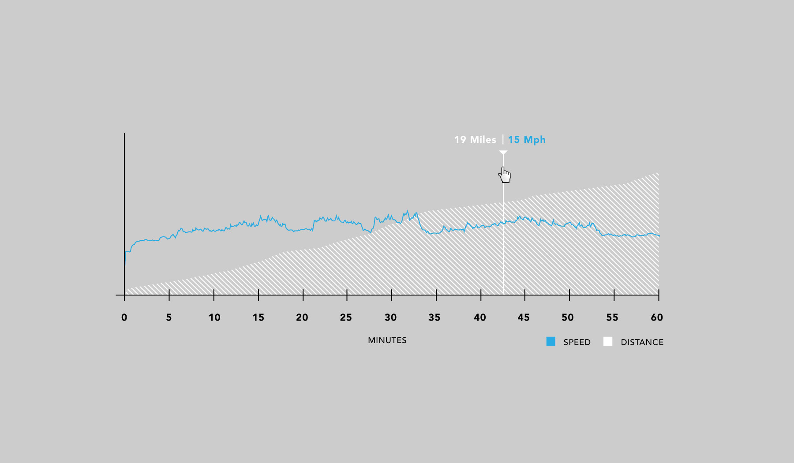
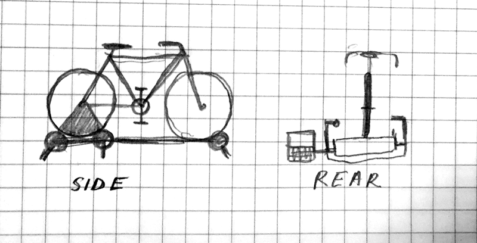

###Visual Design

###Sensor Mount Sketch

###Data Read from IR Sensor (TV Remote)

Ready to decode IR!

Received: 

OFF 	ON
38944 usec, 280 usec
1860 usec, 280 usec
820 usec, 260 usec
800 usec, 260 usec
800 usec, 240 usec
820 usec, 260 usec
780 usec, 280 usec
1860 usec, 280 usec
1860 usec, 280 usec
780 usec, 280 usec
1860 usec, 280 usec
820 usec, 260 usec
780 usec, 280 usec
800 usec, 260 usec
1860 usec, 280 usec
800 usec, 260 usec
47480 usec, 280 usec
1860 usec, 280 usec
820 usec, 240 usec
780 usec, 300 usec
780 usec, 260 usec
800 usec, 260 usec
1880 usec, 280 usec
780 usec, 280 usec
780 usec, 280 usec
1860 usec, 280 usec
800 usec, 260 usec
1860 usec, 280 usec
1860 usec, 280 usec
1880 usec, 280 usec
780 usec, 280 usec
1860 usec, 280 usec
45320 usec, 280 usec
1860 usec, 280 usec
780 usec, 300 usec
760 usec, 280 usec
780 usec, 280 usec
780 usec, 300 usec
780 usec, 280 usec
1860 usec, 280 usec
1860 usec, 280 usec
780 usec, 280 usec
1860 usec, 280 usec
780 usec, 300 usec
780 usec, 280 usec
780 usec, 280 usec
1860 usec, 280 usec
780 usec, 280 usec
47480 usec, 280 usec
1860 usec, 280 usec
780 usec, 280 usec
780 usec, 280 usec
780 usec, 280 usec
780 usec, 280 usec
1860 usec, 300 usec
780 usec, 280 usec
780 usec, 280 usec
1860 usec, 280 usec
780 usec, 280 usec
1860 usec, 280 usec
1860 usec, 300 usec
1860 usec, 280 usec
780 usec, 280 usec
1860 usec, 280 usec
45320 usec, 280 usec
1860 usec, 280 usec
780 usec, 280 usec
780 usec, 280 usec
780 usec, 280 usec
780 usec, 280 usec
800 usec, 280 usec
1860 usec, 280 usec
1860 usec, 280 usec
780 usec, 280 usec
1860 usec, 280 usec
780 usec, 280 usec
780 usec, 300 usec
780 usec, 260 usec
1880 usec, 280 usec
780 usec, 280 usec
47480 usec, 280 usec
1860 usec, 280 usec
780 usec, 280 usec
780 usec, 280 usec
780 usec, 280 usec
780 usec, 300 usec
1840 usec, 300 usec
780 usec, 280 usec
780 usec, 280 usec
1860 usec, 280 usec
780 usec, 280 usec
1860 usec, 280 usec
1860 usec, 300 usec
1860 usec, 280 usec
780 usec, 280 usec
1860 usec, 280 usec
int IRsignal[] = {
// ON, OFF (in 10's of microseconds)
	28, 186,
	28, 82,
	26, 80,
	26, 80,
	24, 82,
	26, 78,
	28, 186,
	28, 186,
	28, 78,
	28, 186,
	28, 82,
	26, 78,
	28, 80,
	26, 186,
	28, 80,
	26, 4748,
	28, 186,
	28, 82,
	24, 78,
	30, 78,
	26, 80,
	26, 188,
	28, 78,
	28, 78,
	28, 186,
	28, 80,
	26, 186,
	28, 186,
	28, 188,
	28, 78,
	28, 186,
	28, 4532,
	28, 186,
	28, 78,
	30, 76,
	28, 78,
	28, 78,
	30, 78,
	28, 186,
	28, 186,
	28, 78,
	28, 186,
	28, 78,
	30, 78,
	28, 78,
	28, 186,
	28, 78,
	28, 4748,
	28, 186,
	28, 78,
	28, 78,
	28, 78,
	28, 78,
	28, 186,
	30, 78,
	28, 78,
	28, 186,
	28, 78,
	28, 186,
	28, 186,
	30, 186,
	28, 78,
	28, 186,
	28, 4532,
	28, 186,
	28, 78,
	28, 78,
	28, 78,
	28, 78,
	28, 80,
	28, 186,
	28, 186,
	28, 78,
	28, 186,
	28, 78,
	28, 78,
	30, 78,
	26, 188,
	28, 78,
	28, 4748,
	28, 186,
	28, 78,
	28, 78,
	28, 78,
	28, 78,
	30, 184,
	30, 78,
	28, 78,
	28, 186,
	28, 78,
	28, 186,
	28, 186,
	30, 186,
	28, 78,
	28, 186,
	28, 0};
