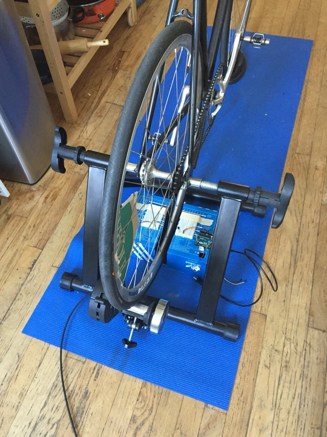

###Assignment 8+9



**Console Output (Running):**

```
...
CURRENT SPEED: 1.0141433382085336
CURRENT SPEED: 3.2756621581150376
CURRENT SPEED: 129.34438954070458
CURRENT SPEED: 531.7491570006745
CURRENT SPEED: 1.4662201020239185
CURRENT SPEED: 3.337337805443563
CURRENT SPEED: 299.10890081287937
CURRENT SPEED: 299.10890081287937
CURRENT SPEED: 1.5517971507801784
CURRENT SPEED: 3.298237362512798
CURRENT SPEED: 3.2119076597356178
CURRENT SPEED: 3.264490049799502
CURRENT SPEED: 3.073694549136847
CURRENT SPEED: 97.66821251032796
CURRENT SPEED: 3.6421175137032495
CURRENT SPEED: 1.1554182551921948
CURRENT SPEED: 3.5319132199306793
CURRENT SPEED: 3.5060383978066447
CURRENT SPEED: 435.06749209146096
CURRENT SPEED: 0.904164446061982
CURRENT SPEED: 598.2178016257587
```

**Console Output (query):**

```
{ command: 'SELECT',
  rowCount: 86,
  oid: NaN,
  rows: 
   [ { datecreated: Mon Nov 07 2016 18:43:06 GMT-0500 (EST),
       speed: 598.218 },
     { datecreated: Mon Nov 07 2016 18:43:06 GMT-0500 (EST),
       speed: 598.218 },
     { datecreated: Mon Nov 07 2016 18:43:06 GMT-0500 (EST),
       speed: 598.218 },
     { datecreated: Mon Nov 07 2016 18:43:06 GMT-0500 (EST),
       speed: 598.218 },
     { datecreated: Mon Nov 07 2016 18:43:06 GMT-0500 (EST),
       speed: 598.218 },
     { datecreated: Mon Nov 07 2016 18:43:09 GMT-0500 (EST),
       speed: 1.42263 },
     { datecreated: Mon Nov 07 2016 18:43:09 GMT-0500 (EST),
       speed: 56.3029 },
     { datecreated: Mon Nov 07 2016 18:43:09 GMT-0500 (EST),
       speed: 598.218 },
     { datecreated: Mon Nov 07 2016 18:43:20 GMT-0500 (EST),
       speed: 0.443946 },
     { datecreated: Mon Nov 07 2016 18:43:20 GMT-0500 (EST),
       speed: 52.5906 },
     { datecreated: Mon Nov 07 2016 18:43:26 GMT-0500 (EST),
       speed: 0.841671 },
     { datecreated: Mon Nov 07 2016 18:43:26 GMT-0500 (EST),
       speed: 59.0832 },
     { datecreated: Mon Nov 07 2016 18:43:26 GMT-0500 (EST),
       speed: 227.893 },
     { datecreated: Mon Nov 07 2016 18:43:26 GMT-0500 (EST),
       speed: 598.218 },
     { datecreated: Mon Nov 07 2016 18:43:39 GMT-0500 (EST),
       speed: 0.35099 },
     { datecreated: Mon Nov 07 2016 18:43:40 GMT-0500 (EST),
       speed: 61.3557 },
     { datecreated: Mon Nov 07 2016 18:43:40 GMT-0500 (EST),
       speed: 78.4548 },
     { datecreated: Mon Nov 07 2016 18:43:43 GMT-0500 (EST),
       speed: 1.65026 },
     { datecreated: Mon Nov 07 2016 18:43:43 GMT-0500 (EST),
       speed: 61.3557 },
     { datecreated: Mon Nov 07 2016 18:43:45 GMT-0500 (EST),
       speed: 1.80935 },
     { datecreated: Mon Nov 07 2016 18:43:45 GMT-0500 (EST),
       speed: 97.6682 },
     { datecreated: Mon Nov 07 2016 18:43:48 GMT-0500 (EST),
       speed: 1.79308 },
     { datecreated: Mon Nov 07 2016 18:43:48 GMT-0500 (EST),
       speed: 66.4686 },
     { datecreated: Mon Nov 07 2016 18:43:50 GMT-0500 (EST),
       speed: 2.88472 },
     { datecreated: Mon Nov 07 2016 18:43:52 GMT-0500 (EST),
       speed: 1.90667 },
     { datecreated: Mon Nov 07 2016 18:43:52 GMT-0500 (EST),
       speed: 368.134 },
     { datecreated: Mon Nov 07 2016 18:43:52 GMT-0500 (EST),
       speed: 299.109 },
     { datecreated: Mon Nov 07 2016 18:43:52 GMT-0500 (EST),
       speed: 199.406 },
     { datecreated: Mon Nov 07 2016 18:43:54 GMT-0500 (EST),
       speed: 2.36567 },
     { datecreated: Mon Nov 07 2016 18:43:54 GMT-0500 (EST),
       speed: 217.534 },
     { datecreated: Mon Nov 07 2016 18:43:57 GMT-0500 (EST),
       speed: 1.86943 },
     { datecreated: Mon Nov 07 2016 18:43:57 GMT-0500 (EST),
       speed: 99.703 },
     { datecreated: Mon Nov 07 2016 18:43:59 GMT-0500 (EST),
       speed: 2.4442 },
     { datecreated: Mon Nov 07 2016 18:43:59 GMT-0500 (EST),
       speed: 299.109 },
     { datecreated: Mon Nov 07 2016 18:43:59 GMT-0500 (EST),
       speed: 82.5128 },
     { datecreated: Mon Nov 07 2016 18:44:01 GMT-0500 (EST),
       speed: 2.52813 },
     { datecreated: Mon Nov 07 2016 18:44:01 GMT-0500 (EST),
       speed: 208.076 },
     { datecreated: Mon Nov 07 2016 18:44:01 GMT-0500 (EST),
       speed: 104.038 },
     { datecreated: Mon Nov 07 2016 18:44:03 GMT-0500 (EST),
       speed: 2.27784 },
     { datecreated: Mon Nov 07 2016 18:44:03 GMT-0500 (EST),
       speed: 90.297 },
     { datecreated: Mon Nov 07 2016 18:44:05 GMT-0500 (EST),
       speed: 3.05603 },
     { datecreated: Mon Nov 07 2016 18:44:06 GMT-0500 (EST),
       speed: 2.76473 },
     { datecreated: Mon Nov 07 2016 18:44:08 GMT-0500 (EST),
       speed: 2.43797 },
     { datecreated: Mon Nov 07 2016 18:44:08 GMT-0500 (EST),
       speed: 435.068 },
     { datecreated: Mon Nov 07 2016 18:44:08 GMT-0500 (EST),
       speed: 184.067 },
     { datecreated: Mon Nov 07 2016 18:44:10 GMT-0500 (EST),
       speed: 3.04243 },
     { datecreated: Mon Nov 07 2016 18:44:10 GMT-0500 (EST),
       speed: 683.677 },
     { datecreated: Mon Nov 07 2016 18:44:10 GMT-0500 (EST),
       speed: 113.946 },
     { datecreated: Mon Nov 07 2016 18:44:10 GMT-0500 (EST),
       speed: 435.068 },
     { datecreated: Mon Nov 07 2016 18:44:12 GMT-0500 (EST),
       speed: 3.05994 },
     { datecreated: Mon Nov 07 2016 18:44:12 GMT-0500 (EST),
       speed: 101.824 },
     { datecreated: Mon Nov 07 2016 18:44:13 GMT-0500 (EST),
       speed: 2.90045 },
     { datecreated: Mon Nov 07 2016 18:44:15 GMT-0500 (EST),
       speed: 2.83684 },
     { datecreated: Mon Nov 07 2016 18:44:15 GMT-0500 (EST),
       speed: 111.296 },
     { datecreated: Mon Nov 07 2016 18:44:16 GMT-0500 (EST),
       speed: 3.37262 },
     { datecreated: Mon Nov 07 2016 18:44:16 GMT-0500 (EST),
       speed: 191.43 },
     { datecreated: Mon Nov 07 2016 18:44:18 GMT-0500 (EST),
       speed: 3.16517 },
     { datecreated: Mon Nov 07 2016 18:44:20 GMT-0500 (EST),
       speed: 3.02895 },
     { datecreated: Mon Nov 07 2016 18:44:21 GMT-0500 (EST),
       speed: 3.10763 },
     { datecreated: Mon Nov 07 2016 18:44:21 GMT-0500 (EST),
       speed: 281.514 },
     { datecreated: Mon Nov 07 2016 18:44:21 GMT-0500 (EST),
       speed: 199.406 },
     { datecreated: Mon Nov 07 2016 18:44:23 GMT-0500 (EST),
       speed: 3.21839 },
     { datecreated: Mon Nov 07 2016 18:44:23 GMT-0500 (EST),
       speed: 598.218 },
     { datecreated: Mon Nov 07 2016 18:44:24 GMT-0500 (EST),
       speed: 3.07369 },
     { datecreated: Mon Nov 07 2016 18:44:30 GMT-0500 (EST),
       speed: 0.776402 },
     { datecreated: Mon Nov 07 2016 18:44:35 GMT-0500 (EST),
       speed: 1.01414 },
     { datecreated: Mon Nov 07 2016 18:44:36 GMT-0500 (EST),
       speed: 3.27566 },
     { datecreated: Mon Nov 07 2016 18:44:37 GMT-0500 (EST),
       speed: 129.344 },
     { datecreated: Mon Nov 07 2016 18:44:37 GMT-0500 (EST),
       speed: 531.749 },
     { datecreated: Mon Nov 07 2016 18:44:40 GMT-0500 (EST),
       speed: 1.46622 },
     { datecreated: Mon Nov 07 2016 18:44:41 GMT-0500 (EST),
       speed: 3.33734 },
     { datecreated: Mon Nov 07 2016 18:44:41 GMT-0500 (EST),
       speed: 299.109 },
     { datecreated: Mon Nov 07 2016 18:44:41 GMT-0500 (EST),
       speed: 299.109 },
     { datecreated: Mon Nov 07 2016 18:44:44 GMT-0500 (EST),
       speed: 1.5518 },
     { datecreated: Mon Nov 07 2016 18:44:46 GMT-0500 (EST),
       speed: 3.29824 },
     { datecreated: Mon Nov 07 2016 18:44:47 GMT-0500 (EST),
       speed: 3.21191 },
     { datecreated: Mon Nov 07 2016 18:44:49 GMT-0500 (EST),
       speed: 3.26449 },
     { datecreated: Mon Nov 07 2016 18:44:50 GMT-0500 (EST),
       speed: 3.07369 },
     { datecreated: Mon Nov 07 2016 18:44:50 GMT-0500 (EST),
       speed: 97.6682 },
     { datecreated: Mon Nov 07 2016 18:44:52 GMT-0500 (EST),
       speed: 3.64212 },
     { datecreated: Mon Nov 07 2016 18:44:56 GMT-0500 (EST),
       speed: 1.15542 },
     { datecreated: Mon Nov 07 2016 18:44:57 GMT-0500 (EST),
       speed: 3.53191 },
     { datecreated: Mon Nov 07 2016 18:44:59 GMT-0500 (EST),
       speed: 3.50604 },
     { datecreated: Mon Nov 07 2016 18:44:59 GMT-0500 (EST),
       speed: 435.068 },
     { datecreated: Mon Nov 07 2016 18:45:04 GMT-0500 (EST),
       speed: 0.904164 },
     { datecreated: Mon Nov 07 2016 18:45:04 GMT-0500 (EST),
       speed: 598.218 } ],
  fields: 
   [ { name: 'datecreated',
       tableID: 16400,
       columnID: 1,
       dataTypeID: 1114,
       dataTypeSize: 8,
       dataTypeModifier: -1,
       format: 'text' },
     { name: 'speed',
       tableID: 16400,
       columnID: 2,
       dataTypeID: 700,
       dataTypeSize: 4,
       dataTypeModifier: -1,
       format: 'text' } ],
  _parsers: [ [Function: parseDate], [Function: parseFloat] ],
  RowCtor: [Function],
  rowAsArray: false,
  _getTypeParser: [Function: bound ] }
```