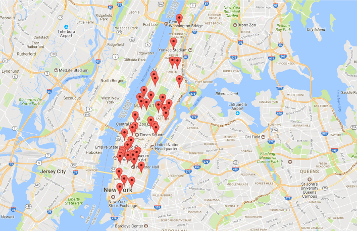
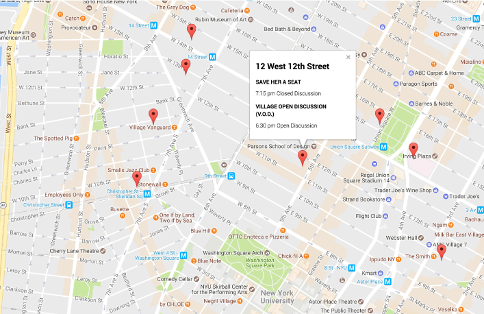

##Data Structures Final Assignment 1




###Scraper.js

Scrapes the meeting data, but unfortunately only captures the first entry per meeting due to issues with async. 

Currently gets itself kicked off of google:

```
{
error_message : “You have exceeded your daily request quota for this API.”,
html_attributions : [],
results : [],
status : “OVER_QUERY_LIMIT”
}
```

Some adjustments were made to try and correct the errors and capture additional data per wheelchair 
accessability and meeting details in scraper+lookups, which doesn't rely on the google api. 

###pushData.js

pushData makes some updates to formatting of the data and pushes it onto a mongo database.

###retrieveData.js

retrieveData serves time-relevant data, attached to slightly modified (for time formatting)
index1.txt and index3.txt files, displaying it on a google map.


```

// Query returns objects like this one:

{ _id : 
	{ latLong : [40.7576496,-73.964016] }, 
	   meetingGroups : 
		[ { groupInfo : 
		  { latLong : [40.7576496,-73.964016],
		   meetingName : “GOTHAM”, 
		   meetingAddress1 : 
		   “350 East 56th Street, New York, NY”
			}
		} ]
	}
...

```