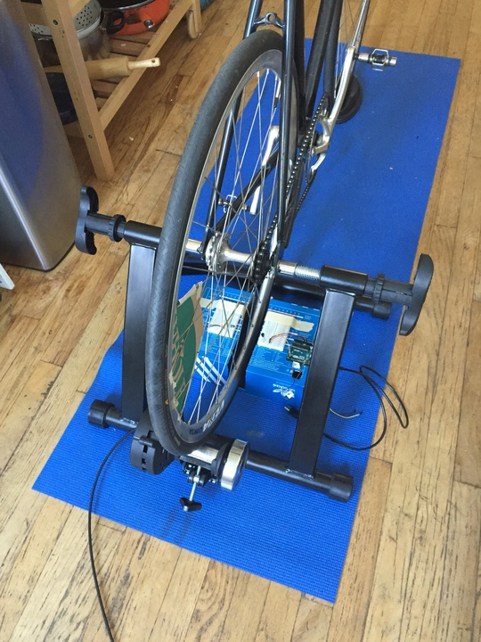

##Data Structures Final Assignment 2

###Visual Design


###Sensor Mount




###Query Sensor Data:

```
[
{
"datecreated": "2016-11-07T23:43:06.565Z",
"speed": 598.218
},
{
"datecreated": "2016-11-07T23:43:06.566Z",
"speed": 598.218
},
{
"datecreated": "2016-11-07T23:43:06.566Z",
"speed": 598.218
},
{
"datecreated": "2016-11-07T23:43:06.569Z",
"speed": 598.218
},
{
"datecreated": "2016-11-07T23:43:06.569Z",
"speed": 598.218
},
{
"datecreated": "2016-11-07T23:43:09.583Z",
"speed": 1.42263
},
{
"datecreated": "2016-11-07T23:43:09.660Z",
"speed": 56.3029
},
{
"datecreated": "2016-11-07T23:43:09.667Z",
"speed": 598.218
},
{
"datecreated": "2016-11-07T23:43:20.464Z",
"speed": 0.443946
},
{
"datecreated": "2016-11-07T23:43:20.538Z",
"speed": 52.5906
},
{
"datecreated": "2016-11-07T23:43:26.248Z",
"speed": 0.841671
},
{
"datecreated": "2016-11-07T23:43:26.305Z",
"speed": 59.0832
},
{
"datecreated": "2016-11-07T23:43:26.327Z",
"speed": 227.893
},
{
"datecreated": "2016-11-07T23:43:26.334Z",
"speed": 598.218
},
{
"datecreated": "2016-11-07T23:43:39.970Z",
"speed": 0.35099
},
{
"datecreated": "2016-11-07T23:43:40.045Z",
"speed": 61.3557
},
{
"datecreated": "2016-11-07T23:43:40.108Z",
"speed": 78.4548
},
{
"datecreated": "2016-11-07T23:43:43.012Z",
"speed": 1.65026
},
{
"datecreated": "2016-11-07T23:43:43.164Z",
"speed": 61.3557
},
{
"datecreated": "2016-11-07T23:43:45.734Z",
"speed": 1.80935
},
{
"datecreated": "2016-11-07T23:43:45.788Z",
"speed": 97.6682
},
{
"datecreated": "2016-11-07T23:43:48.455Z",
"speed": 1.79308
},
{
"datecreated": "2016-11-07T23:43:48.521Z",
"speed": 66.4686
},
{
"datecreated": "2016-11-07T23:43:50.180Z",
"speed": 2.88472
},
{
"datecreated": "2016-11-07T23:43:52.692Z",
"speed": 1.90667
},
{
"datecreated": "2016-11-07T23:43:52.714Z",
"speed": 368.134
},
{
"datecreated": "2016-11-07T23:43:52.723Z",
"speed": 299.109
},
{
"datecreated": "2016-11-07T23:43:52.745Z",
"speed": 199.406
},
{
"datecreated": "2016-11-07T23:43:54.824Z",
"speed": 2.36567
},
{
"datecreated": "2016-11-07T23:43:54.833Z",
"speed": 217.534
},
{
"datecreated": "2016-11-07T23:43:57.348Z",
"speed": 1.86943
},
{
"datecreated": "2016-11-07T23:43:57.400Z",
"speed": 99.703
},
{
"datecreated": "2016-11-07T23:43:59.352Z",
"speed": 2.4442
},
{
"datecreated": "2016-11-07T23:43:59.370Z",
"speed": 299.109
},
{
"datecreated": "2016-11-07T23:43:59.439Z",
"speed": 82.5128
},
{
"datecreated": "2016-11-07T23:44:01.318Z",
"speed": 2.52813
},
{
"datecreated": "2016-11-07T23:44:01.356Z",
"speed": 208.076
},
{
"datecreated": "2016-11-07T23:44:01.391Z",
"speed": 104.038
},
{
"datecreated": "2016-11-07T23:44:03.505Z",
"speed": 2.27784
},
{
"datecreated": "2016-11-07T23:44:03.556Z",
"speed": 90.297
},
{
"datecreated": "2016-11-07T23:44:05.118Z",
"speed": 3.05603
},
{
"datecreated": "2016-11-07T23:44:06.843Z",
"speed": 2.76473
},
{
"datecreated": "2016-11-07T23:44:08.819Z",
"speed": 2.43797
},
{
"datecreated": "2016-11-07T23:44:08.827Z",
"speed": 435.068
},
{
"datecreated": "2016-11-07T23:44:08.843Z",
"speed": 184.067
},
{
"datecreated": "2016-11-07T23:44:10.439Z",
"speed": 3.04243
},
{
"datecreated": "2016-11-07T23:44:10.448Z",
"speed": 683.677
},
{
"datecreated": "2016-11-07T23:44:10.467Z",
"speed": 113.946
},
{
"datecreated": "2016-11-07T23:44:10.476Z",
"speed": 435.068
},
{
"datecreated": "2016-11-07T23:44:12.043Z",
"speed": 3.05994
},
{
"datecreated": "2016-11-07T23:44:12.085Z",
"speed": 101.824
},
{
"datecreated": "2016-11-07T23:44:13.733Z",
"speed": 2.90045
},
{
"datecreated": "2016-11-07T23:44:15.431Z",
"speed": 2.83684
},
{
"datecreated": "2016-11-07T23:44:15.464Z",
"speed": 111.296
},
{
"datecreated": "2016-11-07T23:44:16.885Z",
"speed": 3.37262
},
{
"datecreated": "2016-11-07T23:44:16.907Z",
"speed": 191.43
},
{
"datecreated": "2016-11-07T23:44:18.424Z",
"speed": 3.16517
},
{
"datecreated": "2016-11-07T23:44:20.003Z",
"speed": 3.02895
},
{
"datecreated": "2016-11-07T23:44:21.538Z",
"speed": 3.10763
},
{
"datecreated": "2016-11-07T23:44:21.567Z",
"speed": 281.514
},
{
"datecreated": "2016-11-07T23:44:21.582Z",
"speed": 199.406
},
{
"datecreated": "2016-11-07T23:44:23.141Z",
"speed": 3.21839
},
{
"datecreated": "2016-11-07T23:44:23.150Z",
"speed": 598.218
},
{
"datecreated": "2016-11-07T23:44:24.632Z",
"speed": 3.07369
},
{
"datecreated": "2016-11-07T23:44:30.811Z",
"speed": 0.776402
},
{
"datecreated": "2016-11-07T23:44:35.519Z",
"speed": 1.01414
},
{
"datecreated": "2016-11-07T23:44:36.979Z",
"speed": 3.27566
},
{
"datecreated": "2016-11-07T23:44:37.014Z",
"speed": 129.344
},
{
"datecreated": "2016-11-07T23:44:37.037Z",
"speed": 531.749
},
{
"datecreated": "2016-11-07T23:44:40.295Z",
"speed": 1.46622
},
{
"datecreated": "2016-11-07T23:44:41.724Z",
"speed": 3.33734
},
{
"datecreated": "2016-11-07T23:44:41.748Z",
"speed": 299.109
},
{
"datecreated": "2016-11-07T23:44:41.760Z",
"speed": 299.109
},
{
"datecreated": "2016-11-07T23:44:44.842Z",
"speed": 1.5518
},
{
"datecreated": "2016-11-07T23:44:46.311Z",
"speed": 3.29824
},
{
"datecreated": "2016-11-07T23:44:47.857Z",
"speed": 3.21191
},
{
"datecreated": "2016-11-07T23:44:49.245Z",
"speed": 3.26449
},
{
"datecreated": "2016-11-07T23:44:50.813Z",
"speed": 3.07369
},
{
"datecreated": "2016-11-07T23:44:50.856Z",
"speed": 97.6682
},
{
"datecreated": "2016-11-07T23:44:52.182Z",
"speed": 3.64212
},
{
"datecreated": "2016-11-07T23:44:56.307Z",
"speed": 1.15542
},
{
"datecreated": "2016-11-07T23:44:57.670Z",
"speed": 3.53191
},
{
"datecreated": "2016-11-07T23:44:59.028Z",
"speed": 3.50604
},
{
"datecreated": "2016-11-07T23:44:59.042Z",
"speed": 435.068
},
{
"datecreated": "2016-11-07T23:45:04.332Z",
"speed": 0.904164
},
{
"datecreated": "2016-11-07T23:45:04.342Z",
"speed": 598.218
}
]
```